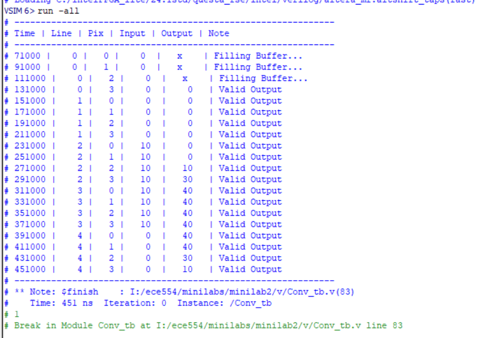

# MiniLab 2 Report

## Implementation

### Greyscale Conversion (`v/RAW2GREY.v`)

We created `v/RAW2GREY.v` by modifying the provided `v/RAW2RGB.v` module. The original module interpolated Bayer pattern data into RGB. We modified it to calculate a single luminance (greyscale) value from the RGB components using standard weighting coefficients (Red: 77, Green: 150, Blue: 29, divided by 256).

```verilog
mGrey <= (77*mCCD_R + 150*(mCCD_G[12:1]) + 29*(mCCD_B)) >> 8;
```

To facilitate easy hot-swapping and testing within the system, we assigned this calculated `mGrey` value to all three output channels (`oRed`, `oGreen`, and `oBlue`). This allows the rest of the display pipeline to treat the signal as a standard RGB image where R=G=B.

### Convolution (`v/Conv.v`)

We implemented a 3x3 convolution module in `v/Conv.v`. This module buffers incoming pixel data using line buffers to access a 3x3 window of pixels simultaneously. It applies a horizontal/vertical filter to this window.

We integrated this module into the top-level design, `DE1_SoC_CAMERA.v`. The flow of data was modified so that the output of `RAW2GREY` feeds into the `Conv` module, and the output of the `Conv` module is sent to the SDRAM controller for display.

## Test Bench

We verified the convolution logic using a test bench located at `v/Conv_tb.v`. 

The test bench (`Conv_tb`) simulates a simplified stream of pixels representing an image with specific features (like a horizontal edge). It feeds these pixels into the `Conv` module and monitors the output to verify that the filter correctly responds to the edge transitions (e.g., producing a high value at the transition between dark and light regions).

The output can be seen here:



## Problems Encountered and Solutions

**Issue: Blown Output**
Initially, the output video from the convolution filter appeared super extreme and bright. 

**Solution:**
We identified that the issue stemmed from how the multiplication was handled in the convolution arithmetic. The pixel values are unsigned, but the filter coefficients are signed (to allow for negative weights in edge detection kernels). We realized we were performing mixed-mode arithmetic without proper casting.

We fixed this by explicitly casting the unsigned pixel values to signed using `$signed()` before multiplying them with the signed filter coefficients. This ensured that the multiplication resulted in the correct signed product, which was then accumulated correctly

#### Before:

```v
// Before...
wire signed [19:0] m00 = p00_r * F00, m01 = p01_r * F01, m02 = p02_r * F02;

// After
wire signed [19:0] m00 = $signed(p00_r) * F00, m01 = $signed(p01_r) * F01, m02 = $signed(p02_r) * F02;
```

This correction eliminated the blown output and produced the expected edge detection output.